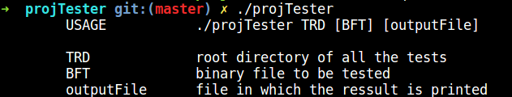

# projTester
Epitech first year project : [CPE] projTester

Second mathematic module project of the first year

Deadline : 2 weeks

Beginning of the project : 16/11/2015, 07h42

Group size : 2 person

Contributor : collet_j

# projTester

The goal of this project is to automate the process of tests execution.

All the tests to be executed will be organized in the following way:

1. a tests root directory (TRD), given as argument to your program, and containing the whole set of tests (grouped via subdirectories or not),

2. TRD sub-directories (or sub-sub-directories, or...) containing a group of tests (the name of the directory being the name of the group of tests),

3. files called Test Description Files (TDFs) that describes tests (the name of the test being the name of the associated file). The extension of those files must be .tdf. Their content will be clarified further on in this document.

Given a TRD and a binary file to test (BFT), the objective of your program is to execute all the tests on the BFT, and
output results.

## Getting started

These instructions will allow you to obtain a copy of the operational project on your local machine for development and testing purposes.

### Prerequisites

What do you need to install the software and how to install it?

```
gcc
make
```

### Installation

Here's how to start the project on your computer

Clone and go in the directory projTester

Project compilation

```
make
```

Running project

```
./projTester TRD [BFT] [outputFile]
```


## Screenshot



## Build with

* [C](https://en.wikipedia.org/wiki/C_(programming_language))

## Auteurs

* **David Munoz** - [DavidMunoz-dev](https://github.com/davidmunoz-dev)
